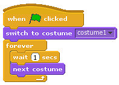
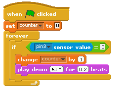
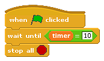

# Sweet Shop Reaction Game

**Introduction**

Some Penny Sweets or Candy can make great input devices for a game using a Raspberry Pi. You will learn how to turn a squiggy sweet into an input button for your Raspberry Pi. You will then create a quick reaction game in Scratch that counts how many times in 10 seconds a player can squeeze your sweet input device!

**Requirements**

This guide assumes that you have the following:
- A Raspberry Pi
- Connected to a monitor or TV
- A keyboard and mouse
- A speaker or headphones
- An SD card with the latest version of Raspbian installed via NOOBS
- ScratchGPIO downloaded and installed. [Use this guide to learn how to do this](http://cymplecy.github.io/scratch_gpio/)
- Two female to female jumper wires
- Two metal paper clips or two dress pins
- Some squiggy sweets/candy like marshmallows or jelly babies
- A cardboard box to put your Raspberry Pi and cables into
- Some colouring pens/pencils to decorate your box.

## Step 0: Set up your Raspberry Pi

You will need to set up your Raspberry Pi to take part in this activity. [See the Raspberry Pi Quick Start Guide here](http://www.raspberrypi.org/quick-start-guide) to get you up and running.

You will be creating your program using ScratchGPIO rather than Scratch. [To download and install ScratchGPIO see here](http://cymplecy.github.io/scratch_gpio/) It is very similar in almost all aspects. If you are not familiar with the scratch interface then [see the Scratch Raspberry Pi Manual here - Page 8](http://pi.cs.man.ac.uk/download/Raspberry_Pi_Education_Manual.pdf) We need to use ScratchGPIO so that you can make a button to control your game using the General Purpose Input Output pins on the Raspberry Pi.

## Step 1: Create a Sweet Munching Sprite

The sweet shop reaction game needs a munching face to entertain the player. You will draw a face using the paint editor in ScratchGPIO and animate it to open and close it's mouth.

**Activity Checklist**

1. On the desktop of your Raspberry Pi you should see a **ScratchGPIO** icon. To open it, double click the icon. It is very important that you use this version of Scratch and not the default application. 

    Click **Ok** to enable remote sensor connections.
    
    

2. Delete the Scratch Cat Sprite by **right clicking** on it with your mouse and selecting **delete**.

3. Click on the **paint new sprite** icon above the sprites palette and draw face with a mouth that is closed using the paint editor. When you are happy with your sprite click **OK**.

4. Next with your newly painted sprite selected, click on the **Costumes tab**. Rename the costume to **face1** by clciking on the sprite name about the edit button and typing the new name. 

5. Click the **copy** button to make an exact copy of the face. You will now have two identical faces on the costumes tab called face1 and face2.

6. The next step is to edit face2 to change the mouth from closed to open. With face 2 selected click on the **edit** button to open the paint editor. 

7. Erase the mouth using a paintbrush tool or an erase tool and then replace it with an open mouth. When you are happy with your sprite costume click **Ok**.

8. To animate your sprite to switch between costumes you will need to click on the **Scripts tab** of your sprite. Drag the control block `when green flag clicked` from the blocks palette to the scripts area.

9. Next drag the look block `switch to costume face1` and connect it to the control block. 

10. Then add the control block `forever` underneath the look block. 

    The `forever` block is a loop that will run the same sequence of blocks inside it over and over again.

11. Add the control block `wait 1 secs` and the look block `next costume` inside the forever loop.

12.	Change the time from 1 second to half a second. How could you represent time as a value? If 1 is a whole, what would half of 1 be?

13. Time to save your work so far and test that your script to animate a sprite works. Go to **File** and **Save As**. Name your file **SweetShopGame** and click **Ok**.

14. Finally click on the **Green Flag** in the top right hand of the screen and you sould see your sprite face open and close it's mouth. 

	

## Step 2: Design a Sweet Shop Background

To make the game a little more interesting let's set the scene by changing the background from the deafult white to something a little more interesting, like a graidant colour or of sweets in a shop!

**Activity Checklist**

1. Click on the **stage** icon next to the sprites palette to change the background.

2. Next locate the **backgrounds** tab and select it with your mouse.

3. If you want to draw your own background, click on the **edit** button underneath the **background1** label. It will open the paint editor. Use the drawing tools to make a more interesting and colourful background.

	**Or**

 	If you would rather add a new background using an image, delete background1 by clicking on the **x** underneath the background1 label. Then click on the **import** button to use a background from the image library, or from a picture that you have saved.

4. When you are happy with your background, click on **sprite1** in the Sprites palette ready to program the reaction game mechanics in the next step.

## Step 3: Program the Sweet Shop Reaction Game Machanics

Many people enjoy testing their reaction time against a clock. Let's create a reaction sytle game using ScratchGPIO that later on we can connect a squiggy sweet button to. The object of the game is to see how many times you can squeeze the sweet button in 10 seconds. 

**Activity Checklist:**

You will need to create two variables for this game, one to count the button presses and one to count time. 

1. Click on variables from the blocks palette and select `make a variable`. Name the first variable **counter** and click **ok**

2. Repeat the first step to create another vairable named **timer**. 

3. Click ont he control blocks plaette and drag the `When green flag clicked` block on to the scripts tab of your face sprite.

4. Next add the variable block `set counter to 0` so that at the start of each game the counter is reset to 0 ready to test the players button pushing skills.

5. Add a `forever` looping block and connect it then place an `if` block inside the `forever` block.

6. There is a small blank space on the `if` block, this is so that you can add other blocks. In this space you need to first add the **operator** block ` = `.

7. Blocks can be added on either side of the `=` block. On the left hand side add the sensing block `slider sensor value` and on the right hand side type the value `0`. Using the drop down menu change **slider** to **pin3**.

8. Inside the `if` block add the variable block `change counter by 1` and `play drum 48 for 0.2 beats`. You can select any drum noise that you like from the drop down menu.

	

To set a time limit for the game the counts upwards, you need to add a futher two scripts:

1. Add `when green flag clicked` block to the scripts and connect the sensing block `reset timer` to it.

2. Underneath connect a `forever` looping control block.

3. Inside the loop add the variable block `set control to 0` and using the drop down menu on the block change **control**to **timer** so that the block reads `set timer to 0`.

4. Replace the value `0` in the `set timer to 0` block with the operator block `round`.

5. Then add the sensing block `timer` inside the space on the `round' block. The completed block should look like:

	

6. Add another `when green flag clicked` control block to the scripts area and connect a `wait until` block to it.

7. Add the operators block `=` to the space in the `wait until` block. In the left hand space add the variable block `timer` and on the right hand side type a value to represent time. If you want your game to last for 10 seconds then type `10`. 

8. Connect a `stop all` control block to the end of this script.

9. Finally save your game by clicking on the save icon at the top of the screen. 

	

## Step 4: Wire up your sweet button

You will need to connect a sweet or piece of candy to your Raspberry Pi to act as an input device and test it.

**Activity Checklist:**

1. Take the metal paper clips and unfold them to make straight wires.

2. Insert the paper clip wire or dress pins into the end of a female to female jumper cable.

3. Do the same to the other jumper cable so that the two cables are identical.

4. Insert the paper clips into a soft sweet so that they are close to each other but not touching. 

    
    
    Raspberry Pi GPIO header pins. The diagram above the pins shows the pin numbers. You will be using pin 3 and pin 25.

5. Take the other end of one of the jumper cables (not connected to a paper clip) and push onto pin 3 of the General Purpose Input-Output (GPIO) header which is connected to one of the GPIO channels.

6. Take the end of the other jumper cable and push onto pin 25 of the GPIO header which is connected to ground.

    **Warning!** You can damage your Raspberry Pi if you do not use the GPIO pins correctly!

Your sweet input device is not a real button and will not give acurate results for your game. It is just a bit of fun. If you want to construct a real button for your game using a breadboard, switch and resistor then follow these instructons: 

## Step 5: Put it all in a box!

Congratulations on making your Sweet Shop Reaction Game. If you have time why not make and decorate a box to put the Raspberry Pi and cables into.

    
